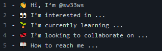

# crispy-system

This is my Module 1 Challenge assignment

# Description

This is my first portfolio website i've made. It was created with html and css, and dispite being a bit rough, it works.

# Installation

Make a new folder, and than download everything but wireframe into it. Than open that folder in any program that can run code, (i used code vs), and your done.

# Usage

Go to https://sw33ws.github.io/crispy-system/ to check out and view the website.

# Credits

https://utoronto.bootcampcontent.com/utoronto-bootcamp/UTOR-VIRT-FSF-FT-05-2022-U-LOLC 
https://courses.bootcampspot.com/

